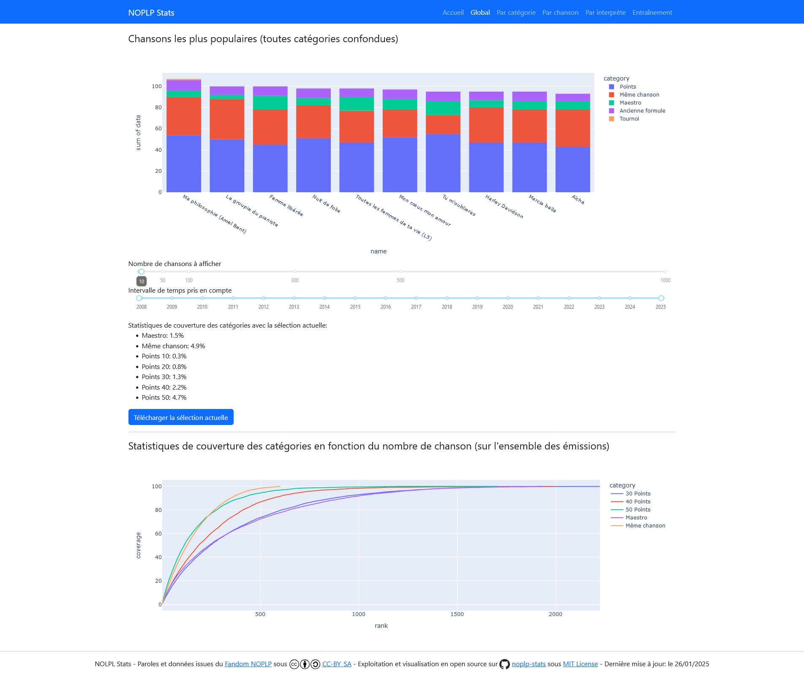
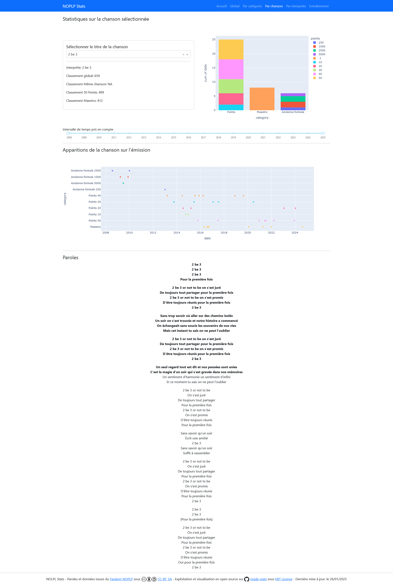
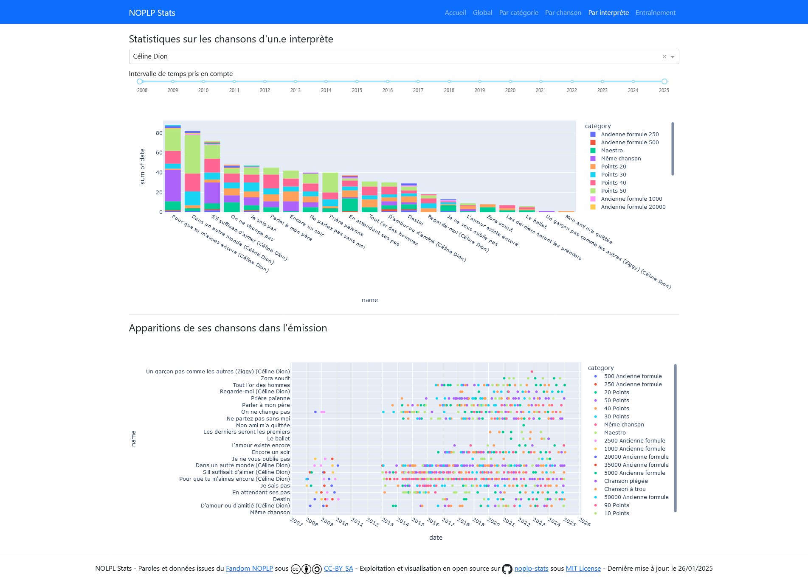

# NOPLP Stats: Latest statistics about *N'oubliez Pas Les Paroles*

## About this app

Python project to exploit and present lastest statistics and data about NOPLP from dedicated [Fandom Wiki](https://n-oubliez-pas-les-paroles.fandom.com/fr/).

See the app here: [https://noplp-stats.oa.r.appspot.com/](https://noplp-stats.oa.r.appspot.com/).

## What can I find?

General statistics about *N'oubliez Pas Les Paroles*, including:

* Most popular songs (choose top list size and timeframe)
* Coverage scores: number of songs to know a whole category!
* Singer and song specific stats:
  * Songs ranking for each singer
  * Graph of all occurrences of a song
  * NOPLP Fandom lyrics, checked on the show (when available)
* Training playground: write the song lyrics to learn them or check your knowledge (match against NOPLP Fandom lyrics)

## Screenshots

### Global statistics page

* Most popular songs on specific time window
* Top 10, 20, 50, etc.

### Song statistics page

* Most popular song ranking in each category (Points, Maestro, Même chanson, etc.)
* Dot chart of song occurences in the show
* Song lyrics, based on the [Fandom Wiki](https://n-oubliez-pas-les-paroles.fandom.com/fr/) lyrics, **verified on the show when written in bold**

### Singer statistics page

* All songs of the same singer, sorted by popularity on the show!
* Dot chart of all songs occurences in the show, for the given singer

### Training page

* You think you remember the lyrics? Check your knwoledge of a song on the training page!
* Song lyrics based on the [Fandom Wiki](https://n-oubliez-pas-les-paroles.fandom.com/fr/) lyrics, **verified on the show when written in bold!**

## License

The data, from [Fandom Wiki](https://n-oubliez-pas-les-paroles.fandom.com/fr/), is under CC-BY-SA license.  
The web app code is under MIT license.
